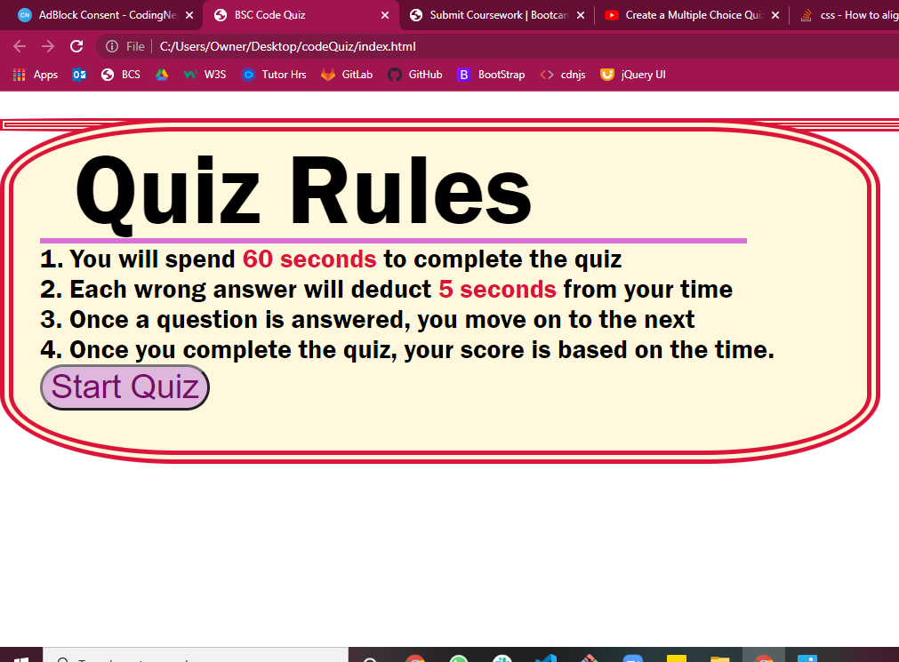

# Homework#5: Code Quiz

## Purpose:
The purpose of quiz is to answer a multiple choice question quiz. 
The game was to save your score, which is based off of the time you finish and then record your score.
It is all done on a timer.

## Problem: 
With the contruction of my application I have run into roadblocks.
At this current moment, the following functionalities are not working:
  - local storage of the time
  - the high score implimented to be presented
  - random text box which would contain the questions and options
  - once you reach the final question, it doesnt close
  
## Link to Page:
https://cathytanya.github.io/codeQuiz/

## Screenshoot

  
  
